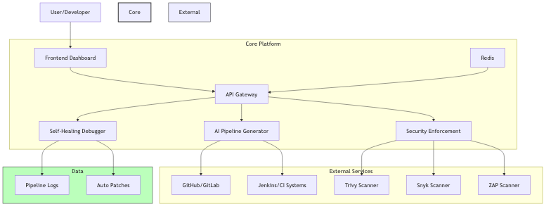

# AI CI/CD Platform

An intelligent continuous integration and delivery platform that leverages artificial intelligence to automate and optimize your development workflow.

## Features

- 🤖 **AI Pipeline Generator**: Automatically generates and optimizes CI/CD pipelines based on your project structure
- 🛡️ **Security Enforcement**: Continuous security scanning and vulnerability detection
- 🔧 **Self-Healing Debugger**: Automated error detection and resolution with enhanced pattern recognition and auto-patching
- 📊 **Real-time Analytics**: Comprehensive metrics and performance insights
- 🚀 **Modern Frontend**: React-based dashboard with Material UI

## Recent Enhancements

### Frontend Dashboard Real-time Updates

The Frontend Dashboard now features comprehensive real-time updates through WebSocket integration:

- **Live Pipeline Status**: Real-time monitoring of pipeline executions with status updates and progress tracking
- **Security Alerts**: Instant notifications of detected vulnerabilities with severity classification
- **Debug Activity Feed**: Live stream of debugging events, error detections, and patch applications
- **WebSocket API**: Standardized event system with categorization and priority levels
- **React Integration Hooks**: Easy-to-use React hooks for WebSocket event subscription

These real-time features significantly enhance the user experience by providing immediate feedback on system activities without requiring page refreshes. See the [WebSocket API Documentation](docs/websocket-api.md) for more details.

### Security Enforcement - Vulnerability Database Integration

The Security Enforcement component has been enhanced with additional vulnerability database integrations:

- **MITRE CVE Database**: Direct integration with the authoritative MITRE CVE database for comprehensive vulnerability information
- **OSV (Open Source Vulnerabilities)**: Integration with Google's OSV database for open source package vulnerabilities across multiple ecosystems
- **VulnDB**: Integration with Risk Based Security's VulnDB for commercial vulnerability intelligence
- **Enhanced OSINT Sources**: Improved aggregation of vulnerability data from multiple Open Source Intelligence sources

These integrations provide more comprehensive vulnerability detection and enriched metadata for better security decision-making.

### Self-Healing Debugger

The Self-Healing Debugger has been significantly enhanced with:

- **Expanded Error Pattern Recognition**: Support for over 100 new error patterns across multiple CI/CD platforms
- **Advanced Auto-Patching**: Improved patch generation for network issues, resource constraints, test failures, and security vulnerabilities
- **Enhanced Validation**: Better validation steps to ensure patches are applied correctly

See the [Self-Healing Debugger README](services/self-healing-debugger/README.md) for more details.

## Project Roadmap

We have a comprehensive plan for enhancing the platform's core functionality. Key focus areas include:

- **ML-Based Error Classification**: Using machine learning to better categorize errors and suggest fixes
- **Interactive Debugging UI**: Improving the WebSocket-based debugging interface
- **Multi-Platform CI/CD Support**: Expanding beyond GitHub Actions to support GitLab CI, CircleCI, Jenkins, etc.
- **Enhanced Security Features**: Adding policy-as-code and automated remediation capabilities
- **Expanded Vulnerability Intelligence**: Further integration with additional vulnerability databases and threat intelligence sources

For the complete roadmap and implementation plan, see our [Project Plan](docs/project-plan.md).

## Architecture

The platform consists of several microservices:

- **Frontend Dashboard**: React/TypeScript web interface
- **API Gateway**: Central entry point for all services
- **AI Pipeline Generator**: ML-powered pipeline creation
- **Security Enforcement**: Vulnerability scanning and security checks
- **Self-Healing Debugger**: Automated debugging and patching



## Prerequisites

- Node.js >= 18
- Python >= 3.9
- Docker & Docker Compose
- Git

## Quick Start with Docker Compose

The easiest way to get started is using Docker Compose:

```bash
# Clone the repository
git clone https://github.com/splinteredsunlight/ai-cicd-platform.git
cd ai-cicd-platform

# Create .env files from examples
find services -name ".env.example" -exec sh -c 'cp "$1" "${1%.example}"' _ {} \;

# Start all services (using Docker Compose V2 syntax)
docker compose up

# Or if you're using older Docker Compose V1
docker-compose up
```

> **Note**: If you get a "command not found" error, you may need to install Docker Compose:
> - **Docker Desktop**: Comes with Docker Compose V2 built-in (use `docker compose up`)
> - **Linux**: Install with `sudo apt-get install docker-compose-plugin` (V2) or `sudo apt-get install docker-compose` (V1)
> - **macOS**: Install with Homebrew using `brew install docker-compose`
> - **Windows**: Install Docker Desktop which includes Docker Compose

This will start all services:
- Frontend Dashboard: http://localhost:3000
- API Gateway: http://localhost:8000
- AI Pipeline Generator: http://localhost:8001
- Security Enforcement: http://localhost:8002
- Self-Healing Debugger: http://localhost:8003

## Manual Setup

If you prefer to run the services without Docker:

1. Set up the frontend dashboard:
   ```bash
   cd services/frontend-dashboard
   cp .env.example .env
   npm install
   npm run dev
   ```

2. Set up the backend services:
   ```bash
   # API Gateway
   cd ../api-gateway
   cp .env.example .env
   pip install -r requirements.txt
   python main.py

   # AI Pipeline Generator
   cd ../ai-pipeline-generator
   cp .env.example .env
   pip install -r requirements.txt
   python main.py

   # Security Enforcement
   cd ../security-enforcement
   cp .env.example .env
   pip install -r requirements.txt
   python main.py

   # Self-Healing Debugger
   cd ../self-healing-debugger
   cp .env.example .env
   pip install -r requirements.txt
   pip install -e .
   python main.py
   ```

## Development Credentials

For the frontend dashboard (development only):
- Email: admin@example.com
- Password: admin123

## Testing

The project includes comprehensive test suites for all services:

### Backend Tests

```bash
# Run tests for a specific service
cd services/self-healing-debugger
pytest

# Run tests with coverage
pytest --cov=.

# Run specific test file
pytest tests/test_log_analyzer.py
```

### Frontend Tests

```bash
cd services/frontend-dashboard
npm test

# Run with coverage
npm test -- --coverage
```

## Continuous Integration

The project uses GitHub Actions for CI/CD. The workflow includes:

- Running tests for all services
- Code linting and formatting checks
- Building the frontend application
- Generating test coverage reports
- Docker Compose validation
- Integration testing

The workflow is configured to run on pull requests and pushes to the main branch. See `.github/workflows/ci.yml` for details.

## API Documentation

Each service includes its own API documentation:

- API Gateway: http://localhost:8000/docs
- AI Pipeline Generator: http://localhost:8001/docs
- Security Enforcement: http://localhost:8002/docs
- Self-Healing Debugger: http://localhost:8003/docs

## Project Structure

```
ai-cicd-platform/
├── .github/workflows/    # CI/CD workflows
├── docker-compose.yml    # Docker Compose configuration
├── services/             # Microservices
│   ├── api-gateway/      # API Gateway service
│   ├── ai-pipeline-generator/ # AI Pipeline Generator service
│   ├── frontend-dashboard/ # React frontend
│   ├── security-enforcement/ # Security scanning service
│   └── self-healing-debugger/ # Debugging service
├── scripts/              # Project management scripts
│   └── push-to-github.sh # Script to push changes to GitHub
└── docs/                 # Documentation
    ├── index.md          # Documentation index
    ├── project-plan.md   # Project roadmap
    └── architecture.md   # System architecture
```

## Development with AI Task Manager

This project includes an AI Task Manager to help streamline development with Cline in VS Code. The task management system helps you:

- Break down complex features into manageable tasks
- Generate context-rich task prompts for Cline
- Track progress on different components
- Maintain context between development sessions
- Automatically generate new tasks when current tasks are completed

To get started with the AI Task Manager:

```bash
# Show current task status
./task status

# Generate a task prompt and create a file for Cline
./task cline

# Use a specialized template for backend services
./task cline --template backend-service

# Mark current task as complete and generate the next task
./task-complete.sh
```

### Automatic Task Generation

The project includes scripts for automatically generating new tasks when current tasks are completed:

- `generate-next-task-prompt.sh`: Generates a new task based on the current task in the task tracking file
- `task-complete.sh`: A simple wrapper script that marks the current task as complete and generates the next task
- `auto-task-complete.sh`: Automatically detects task completion based on commit messages and runs task-complete.sh

These scripts help maintain a continuous workflow by automatically setting up the next task with detailed requirements and context.

#### Simplified Task Management

The project includes scripts for efficient task management:

1. **next-task.sh**: A simple script to generate the next task and open it in VSCode
   - Runs task-complete.sh to generate the next task
   - Commits the new task files
   - Opens the new task file in VSCode for easy copy/paste
   - Displays the task content in the terminal

2. **task-complete.sh**: Marks the current task as complete and generates the next task
   - Updates the task tracking file
   - Creates a new task file with detailed requirements

3. **auto-task-complete.sh**: Integrates task completion with git workflow
   - Detects task completion based on commit messages
   - Runs task-complete.sh to generate the next task

Example workflow:
```bash
# Make your changes for the current task
git add .
git commit -m "Implemented feature X"

# Generate the next task and open it in VSCode
./next-task.sh

# The script will:
# - Run task-complete.sh to generate the next task
# - Commit the new task files
# - Open the new task file in VSCode
# - Display the task content in the terminal
```

This simplified system makes it easy to manage tasks and reduce API fees by efficiently transitioning between tasks.

For more information, see [Using the Task Manager](USING-TASK-MANAGER.md).

## Contributing

1. Fork the repository
2. Create a feature branch
3. Commit your changes
4. Push to the branch
5. Create a Pull Request

### Development Guidelines

- Write tests for all new features
- Maintain code coverage above 80%
- Follow the code style guidelines
- Update documentation as needed
- Use the AI Task Manager for structured development


## License

This project is licensed under the MIT License - see the LICENSE file for details.

## Support

For support, please open an issue in the GitHub repository or contact the maintainers.
# Test commit
# Another test commit
