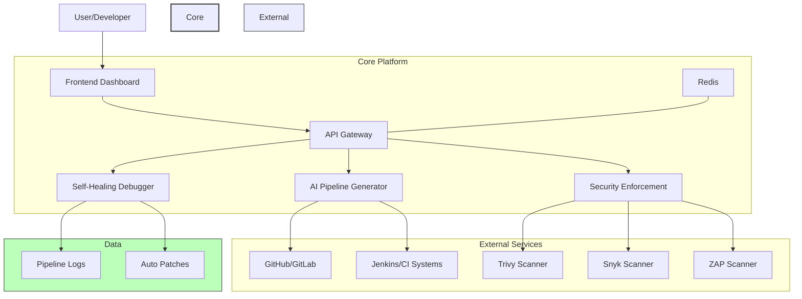
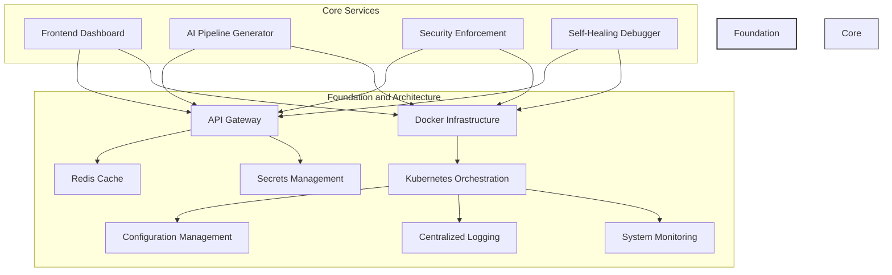
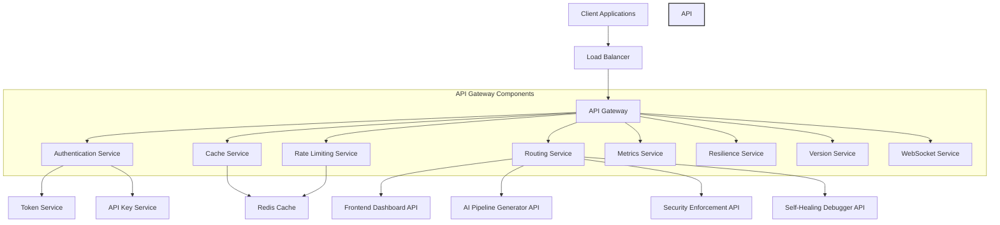
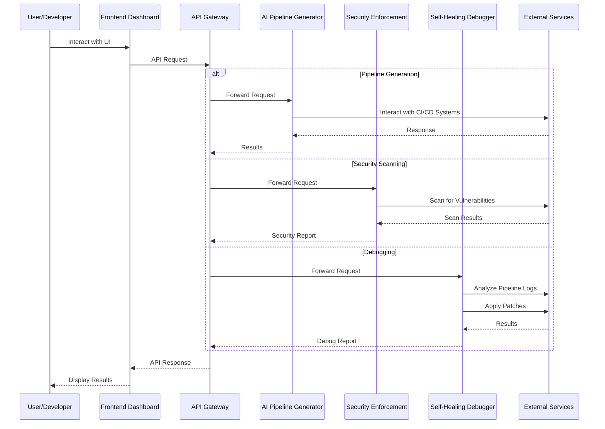
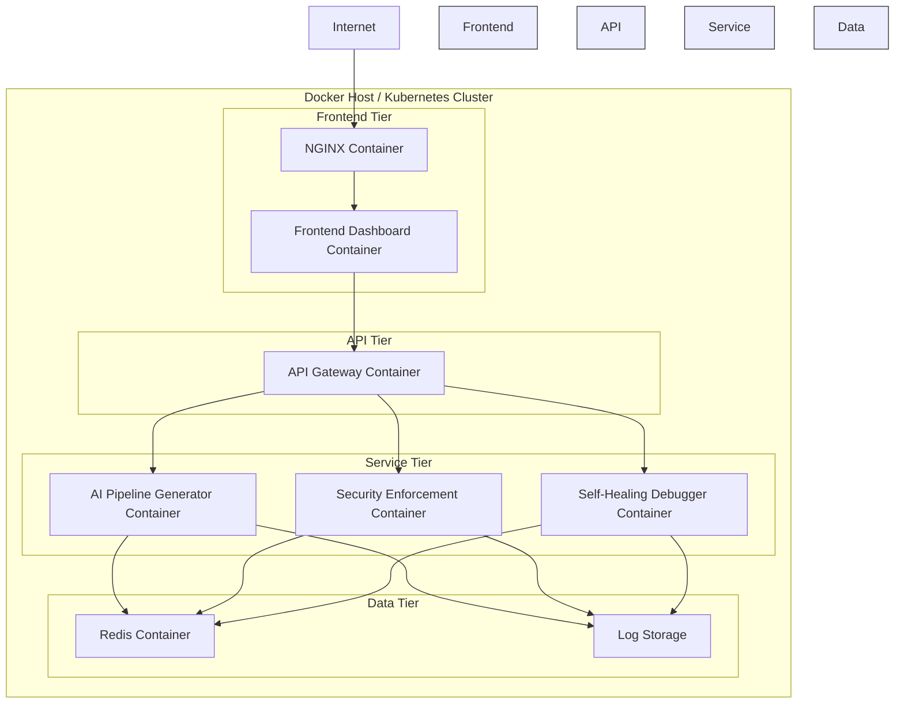
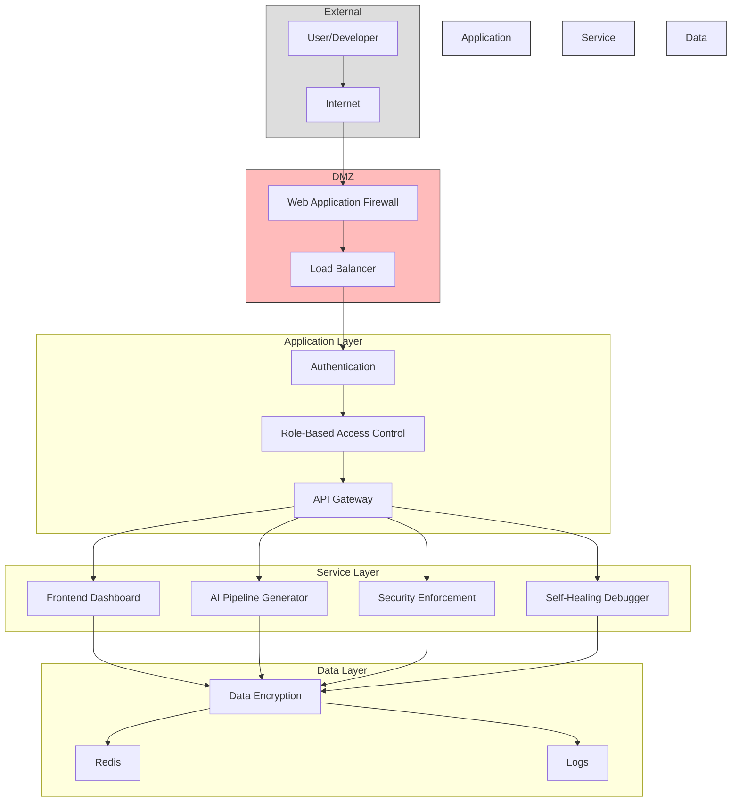
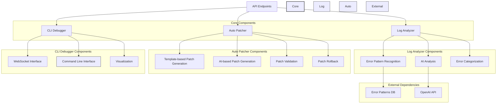
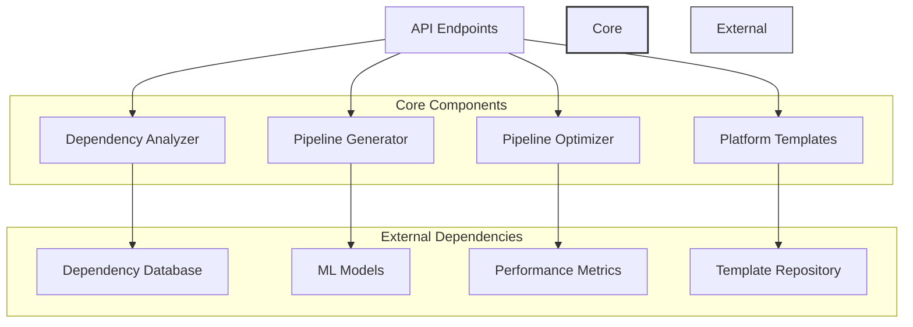
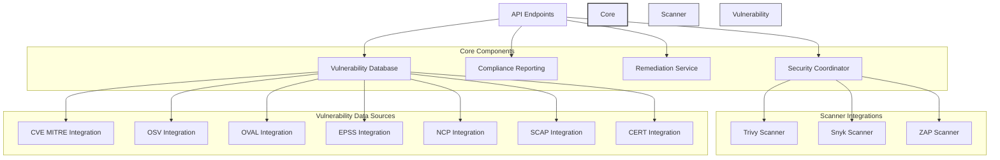
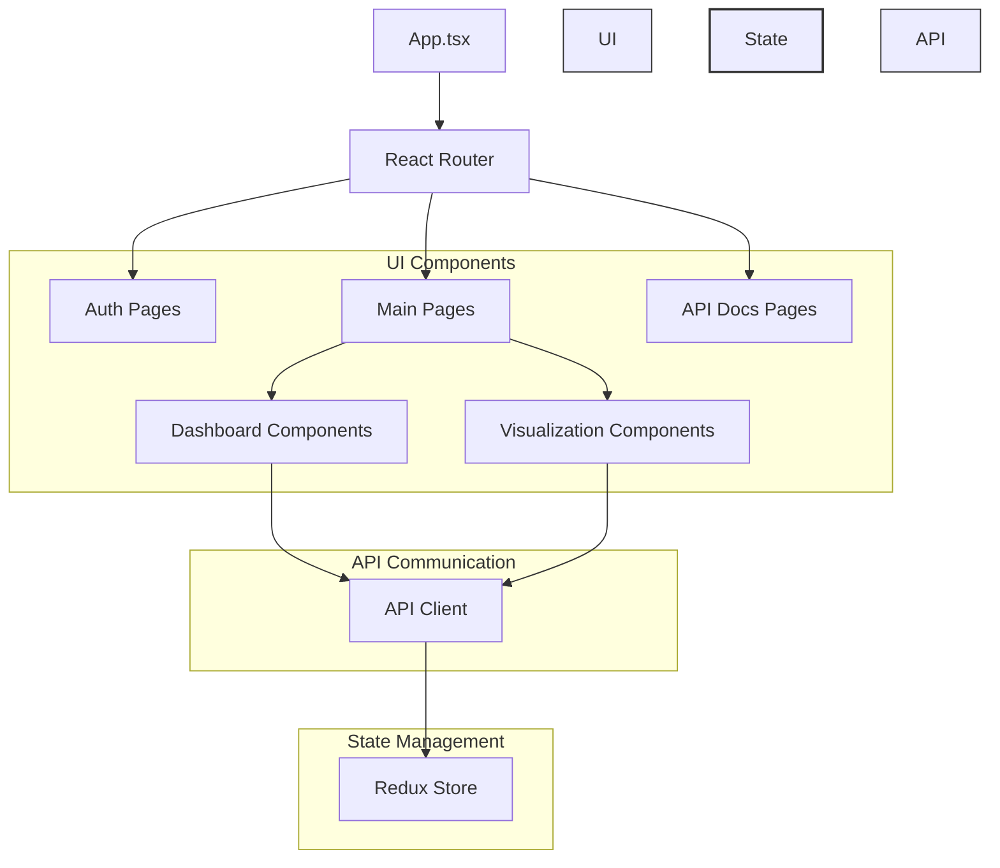

# AI CI/CD Platform Architecture Diagrams

This document contains all the architecture diagrams for the AI CI/CD Platform, providing a visual representation of the system's components, their relationships, and data flows.

## System Overview

The following diagram provides a high-level overview of the entire AI CI/CD Platform:



## Foundation and Architecture Components

The Foundation and Architecture layer provides the core infrastructure and services that support the entire platform:



## API Gateway Architecture

The API Gateway serves as the central entry point for all client requests and handles routing, authentication, rate limiting, and more:



## Data Flow Architecture

This diagram illustrates how data flows through the system:



## Deployment Architecture

The deployment architecture shows how the system is deployed in a containerized environment:



## Security Architecture

The security architecture illustrates the security controls and data protection mechanisms:



## Self-Healing Debugger Architecture

The Self-Healing Debugger service has been enhanced with expanded error pattern recognition and advanced auto-patching capabilities:



## AI Pipeline Generator Architecture

The AI Pipeline Generator service creates and optimizes CI/CD pipelines using machine learning:



## Security Enforcement Architecture

The Security Enforcement service scans for vulnerabilities and enforces security policies:



## Frontend Dashboard Architecture

The Frontend Dashboard provides a user interface for interacting with the platform:



## Generating Diagram Images

To generate PNG images from these Mermaid diagrams:

1. Use the Mermaid CLI:
   ```bash
   mmdc -i docs/architecture-diagrams.md -o docs/architecture-diagrams.png
   ```

2. Or use the Mermaid Live Editor:
   - Go to https://mermaid.live/
   - Copy each diagram code
   - Export as PNG

3. For individual diagrams, you can extract each diagram to its own file:
   ```bash
   # Example for system overview
   mmdc -i docs/architecture-diagrams.md -o docs/system-overview.png -s 1
