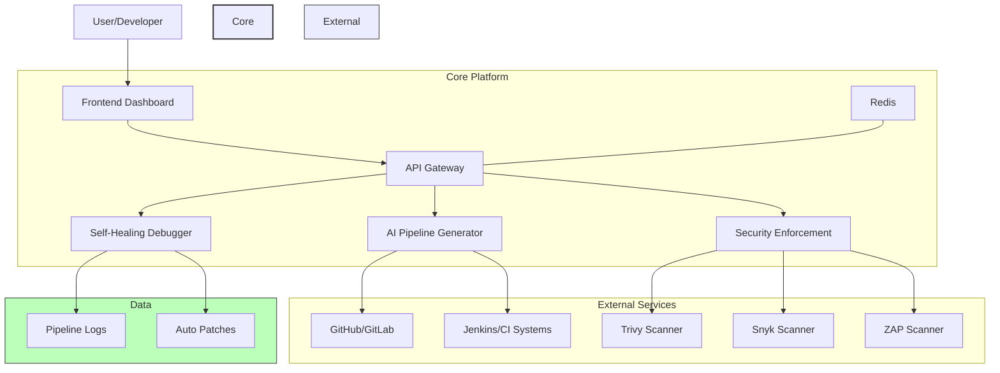
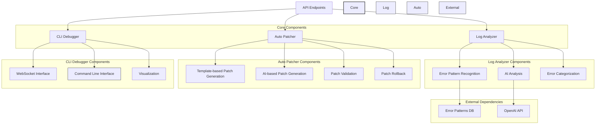

# AI CI/CD Platform Architecture

## Service Descriptions

- **Frontend Dashboard**: React/TypeScript web interface for users to interact with the platform
- **API Gateway**: Central entry point that routes requests to appropriate services
- **AI Pipeline Generator**: Creates and optimizes CI/CD pipelines using ML
- **Security Enforcement**: Scans for vulnerabilities and enforces security policies
- **Self-Healing Debugger**: Automatically detects and fixes pipeline errors with enhanced pattern recognition and auto-patching capabilities

## Communication Flow

1. Users interact with the Frontend Dashboard
2. Frontend makes API calls to the API Gateway
3. API Gateway routes requests to the appropriate microservice
4. Microservices communicate with external tools and services
5. Results are returned through the API Gateway to the Frontend

## Data Storage

- Redis is used for caching, rate limiting, and service discovery
- Each service maintains its own data storage for service-specific information

## Self-Healing Debugger Architecture

The Self-Healing Debugger service has been enhanced with expanded error pattern recognition and advanced auto-patching capabilities. Its internal architecture consists of the following components:

### Component Descriptions

#### Log Analyzer
- **Error Pattern Recognition**: Matches log content against a comprehensive library of error patterns
- **AI Analysis**: Uses OpenAI to analyze log sections not matched by patterns
- **Error Categorization**: Categorizes errors by type, severity, and pipeline stage

#### Auto Patcher
- **Template-based Patch Generation**: Creates patches using predefined templates for common error types
- **AI-based Patch Generation**: Uses AI to generate patches for complex or unknown errors
- **Patch Validation**: Validates patches for safety and effectiveness
- **Patch Rollback**: Provides capability to revert applied patches

#### CLI Debugger
- **WebSocket Interface**: Enables real-time interactive debugging sessions
- **Command Line Interface**: Provides a rich CLI for debugging operations
- **Visualization**: Displays error analysis and debugging metrics

### Error Categories Supported

The enhanced error pattern recognition system supports the following categories:
- Dependency errors (Python, Node.js, Java/Maven, Docker, Go, Ruby)
- Permission errors (file system, Docker, Git, CI/CD platforms, Kubernetes/Cloud)
- Configuration errors (environment variables, CI/CD platforms, Docker, Kubernetes)
- Network errors (connectivity, DNS, proxy, SSL/TLS)
- Resource errors (memory, disk space, CPU, file descriptors)
- Build errors (compilation, syntax, type, linker)
- Test errors (assertions, timeouts, framework-specific)
- Deployment errors (Kubernetes, cloud providers, container registries)
- Security errors (vulnerabilities, authentication, authorization)
