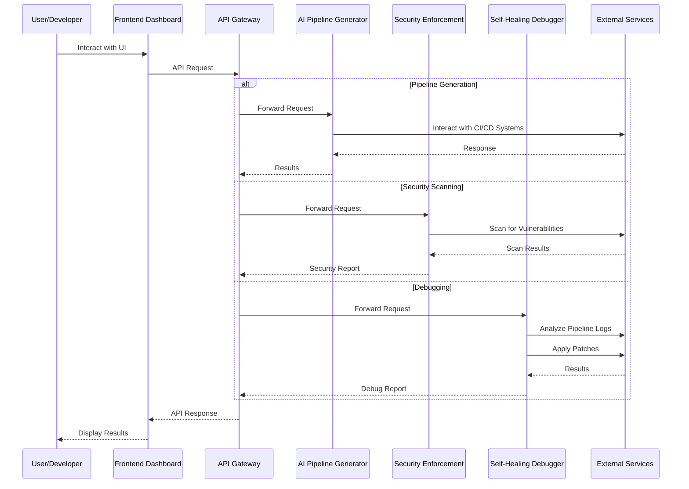
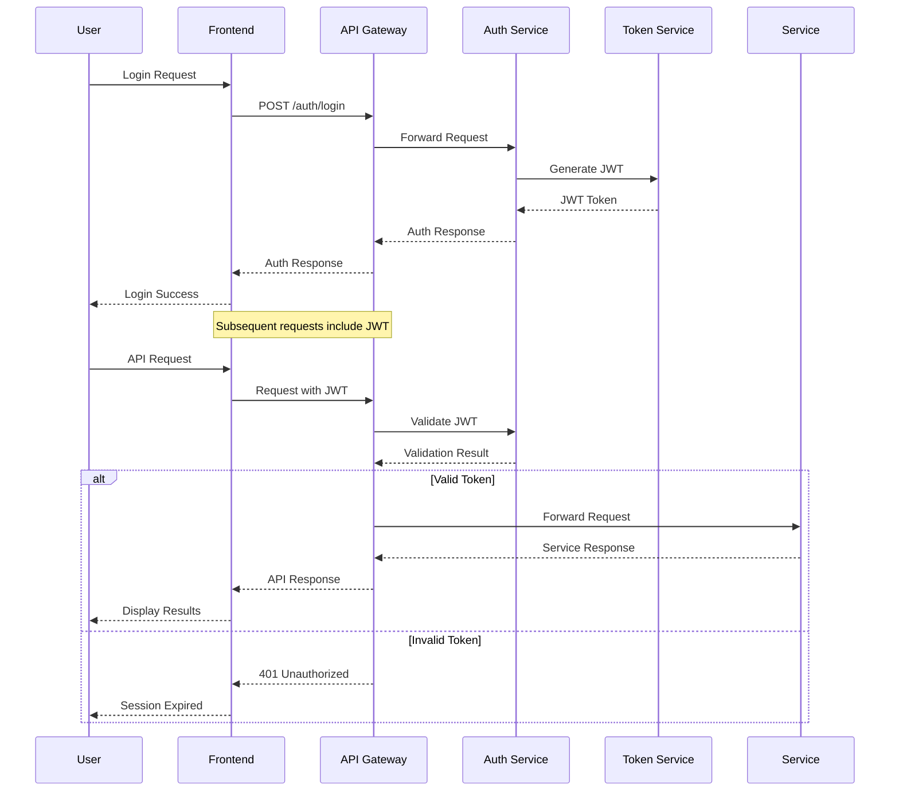
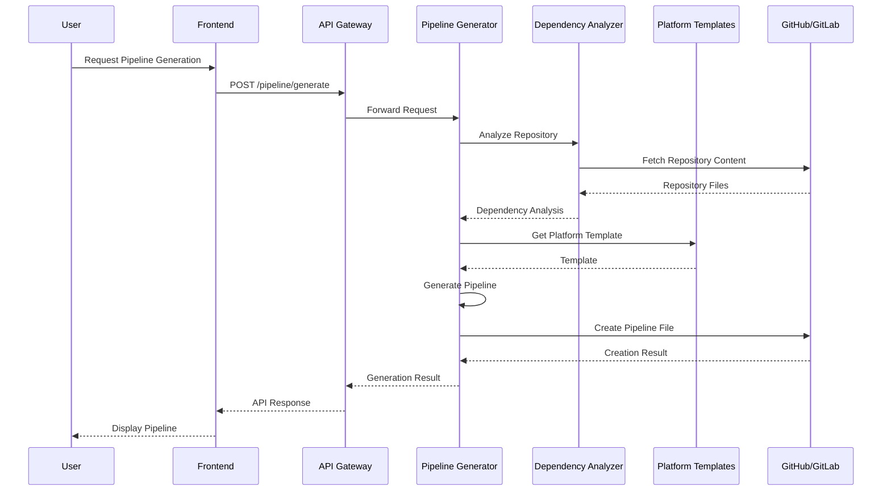
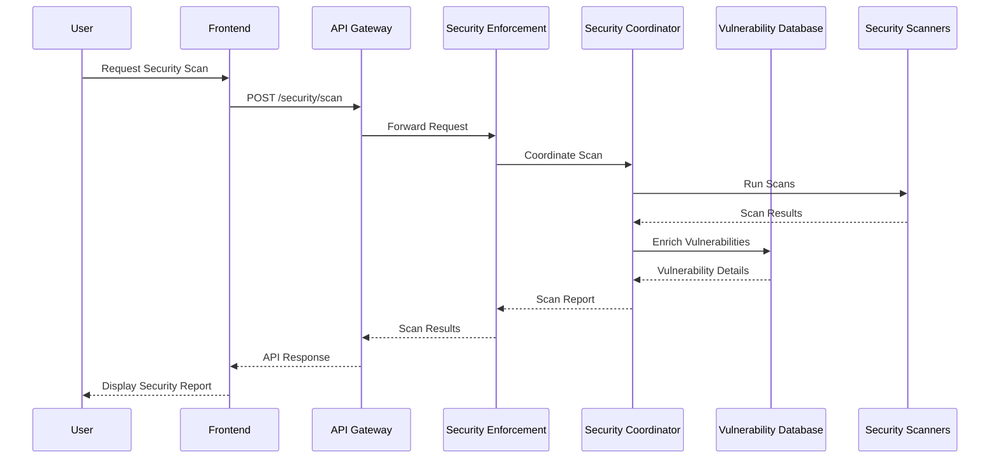
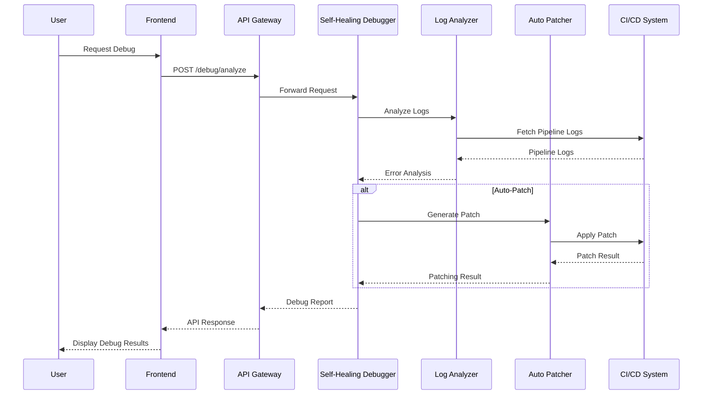
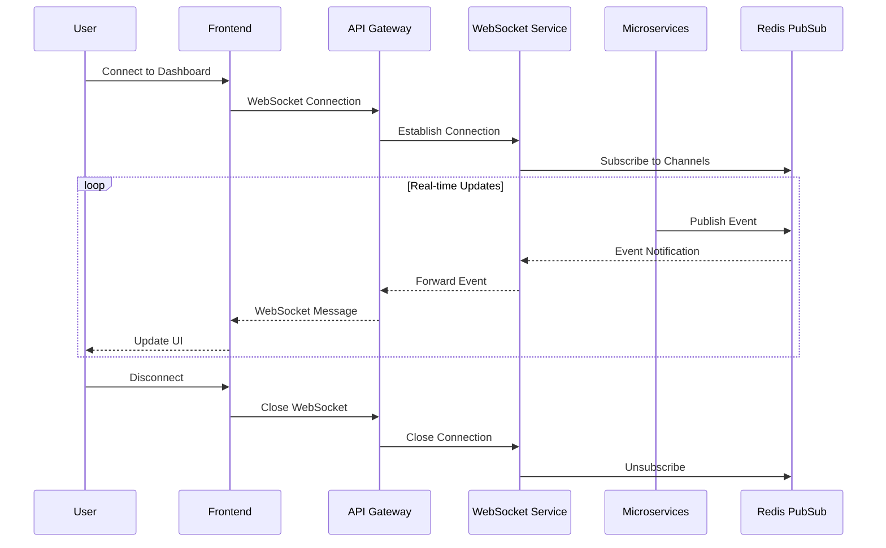

# Data Flow in the AI CI/CD Platform

This document describes how data flows through the AI CI/CD Platform, including the interactions between components, data transformations, and storage mechanisms.

## Overview

The AI CI/CD Platform consists of several microservices that communicate with each other and with external systems. Understanding the data flow is essential for maintaining, debugging, and extending the platform.

## High-Level Data Flow

The following sequence diagram illustrates the high-level data flow through the system:



## Detailed Data Flows

### User Authentication Flow



### Pipeline Generation Flow



### Security Scanning Flow



### Debugging Flow



### Real-time Updates Flow



## Data Storage

### Redis Cache

Redis is used for several purposes in the platform:

1. **API Response Caching**:
   ```
   Key: "cache:{service}:{endpoint}:{query_hash}"
   Value: Serialized API response
   TTL: Configurable per endpoint
   ```

2. **Rate Limiting**:
   ```
   Key: "ratelimit:{user_id}:{endpoint}"
   Value: Counter
   TTL: Rate limit window (e.g., 1 minute)
   ```

3. **Session Storage**:
   ```
   Key: "session:{session_id}"
   Value: Serialized session data
   TTL: Session timeout
   ```

4. **Pub/Sub Channels**:
   ```
   Channels:
   - "events:pipeline:{pipeline_id}"
   - "events:security:{scan_id}"
   - "events:debug:{debug_id}"
   - "events:system"
   ```

### Service-Specific Storage

Each service maintains its own data storage for service-specific information:

1. **AI Pipeline Generator**:
   - Pipeline templates
   - Generated pipelines
   - Dependency analysis results
   - Performance metrics

2. **Security Enforcement**:
   - Vulnerability database
   - Scan results
   - Security policies
   - Compliance reports

3. **Self-Healing Debugger**:
   - Error patterns
   - Debug reports
   - Patch templates
   - Applied patches

## Data Transformations

### Pipeline Generation

1. **Repository Content → Dependency Graph**:
   The Dependency Analyzer parses repository files to identify dependencies between components.

2. **Dependency Graph + Templates → Pipeline Configuration**:
   The Pipeline Generator combines dependency information with platform templates to create optimized CI/CD pipelines.

### Security Scanning

1. **Scan Results → Vulnerability Report**:
   Raw scan results from multiple scanners are normalized, deduplicated, and enriched with vulnerability database information.

2. **Vulnerability Report → Compliance Report**:
   Vulnerabilities are mapped to compliance requirements to generate compliance reports.

### Debugging

1. **Pipeline Logs → Error Analysis**:
   Log entries are parsed and matched against error patterns to identify issues.

2. **Error Analysis → Patch Generation**:
   Identified errors are used to generate appropriate patches based on templates or AI-generated solutions.

## API Contracts

The platform uses OpenAPI (Swagger) for API documentation. Key API endpoints include:

### API Gateway

- `POST /auth/login`: User authentication
- `POST /auth/refresh`: Refresh authentication token
- `GET /api/status`: System status

### AI Pipeline Generator

- `POST /pipeline/analyze`: Analyze repository
- `POST /pipeline/generate`: Generate pipeline
- `POST /pipeline/optimize`: Optimize existing pipeline
- `GET /pipeline/templates`: List available templates

### Security Enforcement

- `POST /security/scan`: Initiate security scan
- `GET /security/vulnerabilities`: List vulnerabilities
- `POST /security/policy`: Create/update security policy
- `GET /security/compliance`: Generate compliance report

### Self-Healing Debugger

- `POST /debug/analyze`: Analyze pipeline logs
- `POST /debug/patch`: Apply auto-patch
- `GET /debug/patterns`: List error patterns
- `POST /debug/session`: Start interactive debugging session

## Error Handling

The platform implements consistent error handling across all services:

1. **API Gateway Errors**:
   - 400: Bad Request
   - 401: Unauthorized
   - 403: Forbidden
   - 404: Not Found
   - 429: Too Many Requests
   - 500: Internal Server Error

2. **Service-Specific Errors**:
   - 4xx: Client errors (with detailed error codes)
   - 5xx: Server errors (with error references for tracking)

All errors include:
- Error code
- Error message
- Error reference (for 5xx errors)
- Timestamp
- Request ID (for correlation)

## Data Security

1. **In Transit**:
   - All API communications use HTTPS
   - WebSocket connections use WSS
   - Service-to-service communication is encrypted

2. **At Rest**:
   - Sensitive data is encrypted
   - Secrets are managed securely
   - Data is backed up regularly

3. **Access Control**:
   - Role-based access control for all APIs
   - Fine-grained permissions
   - Audit logging for sensitive operations

## Monitoring and Observability

The platform includes comprehensive monitoring of data flows:

1. **Request Tracing**:
   - Each request has a unique ID
   - Request path is traced through all services
   - Timing information is collected

2. **Metrics Collection**:
   - Request counts and latencies
   - Error rates
   - Cache hit/miss rates
   - Resource utilization

3. **Logging**:
   - Structured logs (JSON format)
   - Consistent log levels
   - Centralized log collection
   - Log correlation via request IDs
