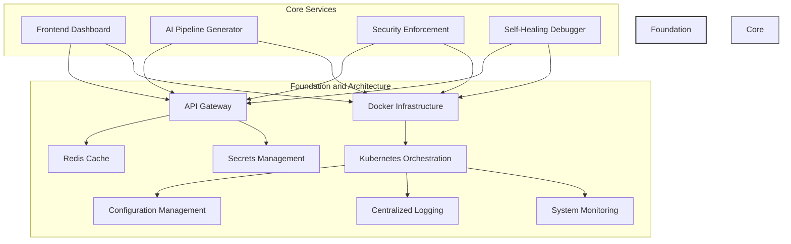
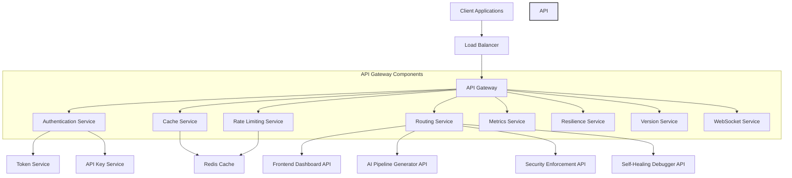
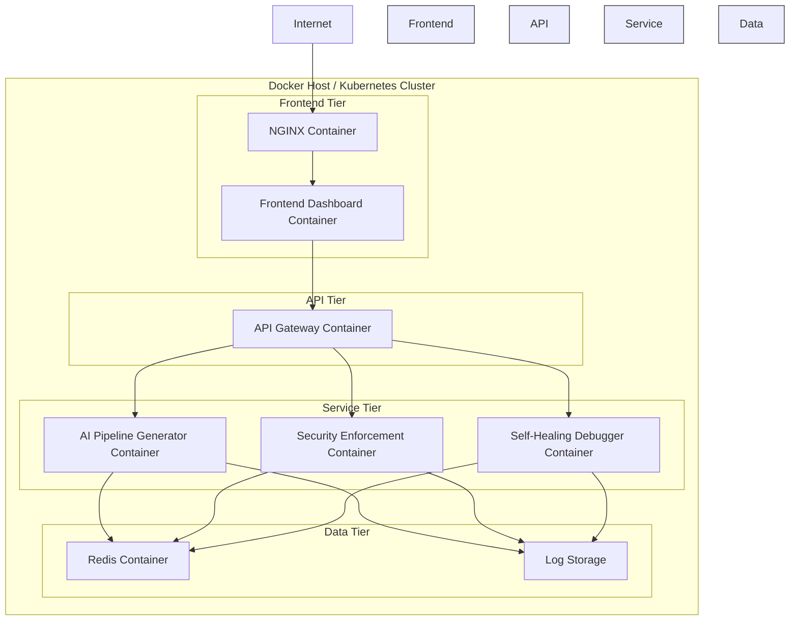
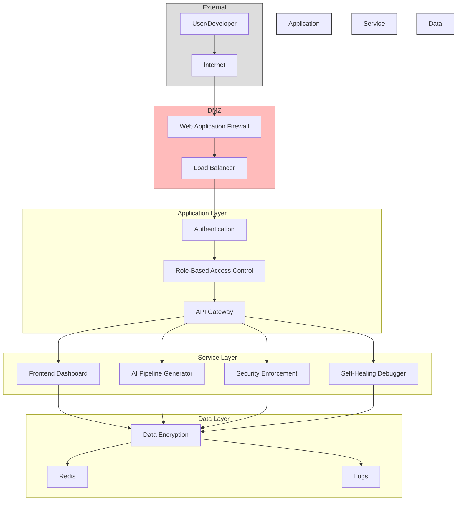

# Foundation and Architecture

## Overview

The Foundation and Architecture layer provides the core infrastructure and services that support the entire AI CI/CD Platform. This layer ensures that all components of the system can communicate effectively, scale as needed, and maintain security and reliability.

## Components

### API Gateway

The API Gateway serves as the central entry point for all client requests and handles:

- **Routing**: Directs requests to the appropriate microservice
- **Authentication**: Verifies user identity and permissions
- **Rate Limiting**: Prevents abuse by limiting request frequency
- **Caching**: Improves performance by caching common responses
- **Metrics Collection**: Gathers usage and performance data
- **Resilience**: Implements circuit breakers and retries for fault tolerance
- **API Versioning**: Manages API versions for backward compatibility
- **WebSocket Support**: Enables real-time communication

#### Implementation Details

The API Gateway is implemented using FastAPI and includes the following services:

- **Authentication Service**: Handles user authentication using JWT tokens and API keys
- **Rate Limiting Service**: Implements tiered rate limiting based on user roles
- **Cache Service**: Uses Redis for efficient caching of responses
- **Routing Service**: Routes requests to the appropriate microservice
- **Metrics Service**: Collects and exposes metrics for monitoring
- **Resilience Service**: Implements circuit breakers and retries
- **Version Service**: Manages API versioning
- **WebSocket Service**: Handles WebSocket connections for real-time updates

### Redis Cache

Redis serves multiple purposes in the platform:

- **Caching**: Stores frequently accessed data to reduce database load
- **Rate Limiting**: Tracks request counts for rate limiting
- **Session Storage**: Stores user session information
- **Pub/Sub Messaging**: Enables communication between microservices
- **Job Queues**: Manages background tasks and job processing

### Docker Infrastructure

The platform uses Docker for containerization, providing:

- **Isolation**: Each service runs in its own container
- **Portability**: Consistent environment across development and production
- **Scalability**: Easy scaling of individual services
- **Resource Efficiency**: Optimized resource usage
- **Versioning**: Clear versioning of service images

### Kubernetes Orchestration

Kubernetes manages the containerized services, providing:

- **Service Discovery**: Automatic discovery of services
- **Load Balancing**: Distribution of traffic across service instances
- **Self-Healing**: Automatic recovery from failures
- **Horizontal Scaling**: Automatic scaling based on load
- **Rolling Updates**: Zero-downtime deployments
- **Resource Management**: Efficient allocation of compute resources

### Configuration Management

The configuration management system provides:

- **Centralized Configuration**: Single source of truth for all service configurations
- **Environment-Specific Settings**: Different configurations for development, testing, and production
- **Secret Management Integration**: Secure handling of sensitive configuration
- **Dynamic Reconfiguration**: Ability to change configuration without restarting services
- **Configuration Validation**: Ensures configurations are valid before applying

### Secrets Management

The secrets management system ensures secure handling of sensitive information:

- **Encryption**: All secrets are encrypted at rest and in transit
- **Access Control**: Fine-grained control over who can access which secrets
- **Rotation**: Automatic rotation of secrets
- **Audit Logging**: Tracking of all secret access
- **Integration**: Seamless integration with Kubernetes and other services

### Centralized Logging

The logging system aggregates logs from all services:

- **Log Collection**: Collects logs from all containers and services
- **Structured Logging**: Enforces consistent log formats
- **Search and Analysis**: Enables searching and analysis of logs
- **Alerting**: Triggers alerts based on log patterns
- **Retention Policies**: Manages log retention and archiving

### System Monitoring

The monitoring system tracks the health and performance of all services:

- **Health Checks**: Regular checks of service health
- **Performance Metrics**: Collection of CPU, memory, and other resource metrics
- **Custom Metrics**: Service-specific metrics for business logic
- **Dashboards**: Visual representation of system health
- **Alerting**: Notifications when metrics exceed thresholds

## Architecture Diagram

## API Gateway Architecture

## Deployment Architecture

## Security Architecture

## Implementation Guidelines

### API Gateway

- Use FastAPI for the API Gateway implementation
- Implement authentication using JWT tokens and API keys
- Use Redis for rate limiting and caching
- Implement circuit breakers for resilience
- Use semantic versioning for API versions

### Docker Infrastructure

- Use multi-stage builds for smaller images
- Implement health checks for all containers
- Use non-root users in containers
- Implement resource limits for all containers
- Use Docker Compose for local development

### Kubernetes Orchestration

- Use Helm charts for deployment
- Implement pod disruption budgets for high availability
- Use horizontal pod autoscalers for scaling
- Implement network policies for security
- Use persistent volumes for stateful services

### Configuration Management

- Use ConfigMaps for non-sensitive configuration
- Implement validation for all configuration
- Use environment-specific configuration
- Implement a configuration change audit trail
- Support dynamic reconfiguration where possible

### Secrets Management

- Use Kubernetes Secrets or a dedicated secrets management solution
- Implement secret rotation
- Use encryption for all secrets
- Implement access control for secrets
- Audit all secret access

### Centralized Logging

- Use structured logging (JSON format)
- Implement log aggregation
- Use log levels appropriately
- Include request IDs for tracing
- Implement log retention policies

### System Monitoring

- Implement health checks for all services
- Collect standard metrics (CPU, memory, etc.)
- Implement custom metrics for business logic
- Set up alerting for critical issues
- Create dashboards for system health visualization

## Best Practices

1. **Security First**: Implement security at every layer
2. **Automation**: Automate deployment, scaling, and recovery
3. **Observability**: Ensure all components are observable through logs, metrics, and traces
4. **Resilience**: Design for failure and implement graceful degradation
5. **Scalability**: Design components to scale horizontally
6. **Consistency**: Use consistent patterns and practices across all components
7. **Documentation**: Maintain up-to-date documentation for all components
8. **Testing**: Implement comprehensive testing at all levels
9. **Performance**: Monitor and optimize performance regularly
10. **Simplicity**: Keep designs as simple as possible while meeting requirements

## Future Enhancements

1. **Service Mesh**: Implement a service mesh for advanced traffic management
2. **GitOps**: Implement GitOps for infrastructure and configuration management
3. **Zero Trust Security**: Implement a zero trust security model
4. **Advanced Observability**: Implement distributed tracing
5. **Multi-Region Deployment**: Support deployment across multiple regions for high availability
6. **Chaos Engineering**: Implement chaos engineering practices to test resilience
7. **AI-Driven Operations**: Use AI for anomaly detection and automated remediation
8. **Edge Computing Support**: Extend the platform to support edge computing scenarios
9. **Serverless Integration**: Support serverless components where appropriate
10. **Advanced Analytics**: Implement advanced analytics for system behavior
