# Integration Points

This document describes the integration points between the AI CI/CD Platform and external systems, including CI/CD platforms, version control systems, security tools, and other third-party services.

## Overview

The AI CI/CD Platform is designed to integrate with a variety of external systems to provide a comprehensive CI/CD solution. These integrations allow the platform to:

- Generate and optimize CI/CD pipelines for different CI/CD platforms
- Scan code for security vulnerabilities using multiple security tools
- Debug and fix pipeline errors across different CI/CD environments
- Provide real-time updates and notifications

## CI/CD Platform Integrations

### GitHub Actions

The platform integrates with GitHub Actions to:

- Generate optimized workflow files (`.github/workflows/*.yml`)
- Analyze and optimize existing workflows
- Monitor workflow runs and collect metrics
- Debug workflow failures and apply fixes

**Integration Method**: GitHub API v3/v4 (GraphQL)

**Authentication**: GitHub App or OAuth App

**Key Endpoints**:
- `POST /repos/{owner}/{repo}/actions/workflows/{workflow_id}/dispatches`
- `GET /repos/{owner}/{repo}/actions/runs`
- `GET /repos/{owner}/{repo}/actions/runs/{run_id}/logs`

### GitLab CI

The platform integrates with GitLab CI to:

- Generate optimized `.gitlab-ci.yml` files
- Analyze and optimize existing pipelines
- Monitor pipeline runs and collect metrics
- Debug pipeline failures and apply fixes

**Integration Method**: GitLab API v4

**Authentication**: Personal Access Token or OAuth

**Key Endpoints**:
- `POST /projects/{id}/pipeline`
- `GET /projects/{id}/pipelines`
- `GET /projects/{id}/pipelines/{pipeline_id}/jobs`

### Jenkins

The platform integrates with Jenkins to:

- Generate Jenkinsfile (declarative or scripted pipeline)
- Analyze and optimize existing pipelines
- Monitor job runs and collect metrics
- Debug job failures and apply fixes

**Integration Method**: Jenkins REST API

**Authentication**: API Token or Basic Auth

**Key Endpoints**:
- `POST /job/{name}/build`
- `GET /job/{name}/lastBuild/api/json`
- `GET /job/{name}/{number}/consoleText`

### CircleCI

The platform integrates with CircleCI to:

- Generate optimized `.circleci/config.yml` files
- Analyze and optimize existing configurations
- Monitor workflow runs and collect metrics
- Debug job failures and apply fixes

**Integration Method**: CircleCI API v2

**Authentication**: API Token

**Key Endpoints**:
- `POST /project/{project-slug}/pipeline`
- `GET /project/{project-slug}/pipeline/{pipeline-id}`
- `GET /project/{project-slug}/job/{job-number}/artifacts`

### Azure DevOps

The platform integrates with Azure DevOps to:

- Generate optimized pipeline YAML files
- Analyze and optimize existing pipelines
- Monitor pipeline runs and collect metrics
- Debug pipeline failures and apply fixes

**Integration Method**: Azure DevOps REST API

**Authentication**: Personal Access Token

**Key Endpoints**:
- `POST /{organization}/{project}/_apis/build/builds`
- `GET /{organization}/{project}/_apis/build/builds/{buildId}`
- `GET /{organization}/{project}/_apis/build/builds/{buildId}/logs`

## Version Control System Integrations

### GitHub

The platform integrates with GitHub repositories to:

- Clone repositories for analysis
- Create pull requests with pipeline configurations
- Apply patches and fixes
- Monitor repository events

**Integration Method**: GitHub API v3/v4 (GraphQL)

**Authentication**: GitHub App or OAuth App

**Key Endpoints**:
- `GET /repos/{owner}/{repo}/contents/{path}`
- `POST /repos/{owner}/{repo}/pulls`
- `POST /repos/{owner}/{repo}/issues/{issue_number}/comments`

### GitLab

The platform integrates with GitLab repositories to:

- Clone repositories for analysis
- Create merge requests with pipeline configurations
- Apply patches and fixes
- Monitor repository events

**Integration Method**: GitLab API v4

**Authentication**: Personal Access Token or OAuth

**Key Endpoints**:
- `GET /projects/{id}/repository/files/{file_path}`
- `POST /projects/{id}/merge_requests`
- `POST /projects/{id}/merge_requests/{merge_request_iid}/notes`

### Bitbucket

The platform integrates with Bitbucket repositories to:

- Clone repositories for analysis
- Create pull requests with pipeline configurations
- Apply patches and fixes
- Monitor repository events

**Integration Method**: Bitbucket API v2

**Authentication**: OAuth or App Password

**Key Endpoints**:
- `GET /repositories/{workspace}/{repo_slug}/src/{commit}/{path}`
- `POST /repositories/{workspace}/{repo_slug}/pullrequests`
- `POST /repositories/{workspace}/{repo_slug}/pullrequests/{pull_request_id}/comments`

## Security Tool Integrations

### Trivy Scanner

The platform integrates with Trivy to:

- Scan container images for vulnerabilities
- Scan filesystem for vulnerabilities
- Scan infrastructure as code (IaC) files

**Integration Method**: CLI and API

**Authentication**: N/A (Open Source)

**Key Commands**:
- `trivy image {image_name}`
- `trivy fs {path}`
- `trivy config {path}`

### Snyk Scanner

The platform integrates with Snyk to:

- Scan application dependencies for vulnerabilities
- Scan container images for vulnerabilities
- Scan infrastructure as code (IaC) files

**Integration Method**: Snyk API

**Authentication**: API Token

**Key Endpoints**:
- `POST /api/v1/test/npm`
- `POST /api/v1/test/docker`
- `POST /api/v1/test/terraform`

### OWASP ZAP Scanner

The platform integrates with OWASP ZAP to:

- Perform dynamic application security testing (DAST)
- Identify web application vulnerabilities
- Generate security reports

**Integration Method**: ZAP API

**Authentication**: API Key

**Key Endpoints**:
- `GET /JSON/spider/action/scan/`
- `GET /JSON/ascan/action/scan/`
- `GET /JSON/core/view/alerts/`

## Vulnerability Database Integrations

### MITRE CVE Database

The platform integrates with the MITRE CVE database to:

- Retrieve comprehensive vulnerability information
- Enrich vulnerability reports with CVE details
- Track vulnerability status and updates

**Integration Method**: NVD API

**Authentication**: API Key

**Key Endpoints**:
- `GET /rest/json/cves/2.0`
- `GET /rest/json/cve/{cveId}`

### OSV (Open Source Vulnerabilities)

The platform integrates with OSV to:

- Retrieve vulnerability information for open source packages
- Map vulnerabilities to affected package versions
- Track vulnerability fixes

**Integration Method**: OSV API

**Authentication**: N/A (Open API)

**Key Endpoints**:
- `POST /v1/query`
- `GET /v1/vulns/{id}`

### OVAL (Open Vulnerability and Assessment Language)

The platform integrates with OVAL repositories to:

- Retrieve standardized vulnerability definitions
- Map vulnerabilities to system configurations
- Assess system compliance

**Integration Method**: OVAL Repository API

**Authentication**: N/A (Open Data)

**Key Endpoints**:
- `GET /api/oval/{oval_id}`
- `GET /api/oval/definitions`

### EPSS (Exploit Prediction Scoring System)

The platform integrates with EPSS to:

- Retrieve exploit likelihood scores for vulnerabilities
- Prioritize vulnerabilities based on exploit probability
- Enhance risk assessment

**Integration Method**: EPSS API

**Authentication**: N/A (Open Data)

**Key Endpoints**:
- `GET /api/v1/epss/{cve_id}`
- `GET /api/v1/epss/scores`

## Notification Integrations

### Slack

The platform integrates with Slack to:

- Send notifications about pipeline status
- Alert on security vulnerabilities
- Provide debugging information

**Integration Method**: Slack API

**Authentication**: OAuth or Bot Token

**Key Endpoints**:
- `POST /api/chat.postMessage`
- `POST /api/files.upload`

### Microsoft Teams

The platform integrates with Microsoft Teams to:

- Send notifications about pipeline status
- Alert on security vulnerabilities
- Provide debugging information

**Integration Method**: Microsoft Graph API

**Authentication**: OAuth

**Key Endpoints**:
- `POST /v1.0/teams/{team-id}/channels/{channel-id}/messages`
- `POST /v1.0/teams/{team-id}/channels/{channel-id}/tabs`

### Email

The platform integrates with email systems to:

- Send notifications about pipeline status
- Alert on security vulnerabilities
- Provide debugging information

**Integration Method**: SMTP

**Authentication**: SMTP Authentication

## Authentication Integrations

### OAuth 2.0

The platform supports OAuth 2.0 for:

- User authentication
- Third-party service integration
- API access control

**Supported Flows**:
- Authorization Code
- Client Credentials
- Implicit (for legacy systems)

### OpenID Connect

The platform supports OpenID Connect for:

- User authentication
- Single sign-on (SSO)
- Identity verification

**Supported Flows**:
- Authorization Code
- Implicit
- Hybrid

### SAML 2.0

The platform supports SAML 2.0 for:

- Enterprise single sign-on (SSO)
- Identity federation
- Access control

## Cloud Provider Integrations

### AWS

The platform integrates with AWS services to:

- Deploy applications to AWS
- Utilize AWS services in pipelines
- Monitor AWS resources

**Key Services**:
- AWS CodeBuild
- AWS CodeDeploy
- AWS CodePipeline
- Amazon ECR
- AWS Lambda

### Azure

The platform integrates with Azure services to:

- Deploy applications to Azure
- Utilize Azure services in pipelines
- Monitor Azure resources

**Key Services**:
- Azure App Service
- Azure Container Registry
- Azure Functions
- Azure Kubernetes Service
- Azure Monitor

### Google Cloud

The platform integrates with Google Cloud services to:

- Deploy applications to Google Cloud
- Utilize Google Cloud services in pipelines
- Monitor Google Cloud resources

**Key Services**:
- Google Kubernetes Engine
- Cloud Build
- Cloud Run
- Container Registry
- Cloud Functions

## Integration Architecture

The following diagram illustrates the integration architecture of the AI CI/CD Platform:

```mermaid
graph TD
    subgraph "AI CI/CD Platform"
        API[API Gateway]
        PG[Pipeline Generator]
        SE[Security Enforcement]
        SHD[Self-Healing Debugger]
    end
    
    subgraph "CI/CD Platforms"
        GHA[GitHub Actions]
        GL[GitLab CI]
        JK[Jenkins]
        CC[CircleCI]
        AZ[Azure DevOps]
    end
    
    subgraph "Version Control"
        GH[GitHub]
        GLR[GitLab]
        BB[Bitbucket]
    end
    
    subgraph "Security Tools"
        TV[Trivy]
        SN[Snyk]
        ZAP[OWASP ZAP]
    end
    
    subgraph "Vulnerability DBs"
        CVE[MITRE CVE]
        OSV[OSV]
        OVAL[OVAL]
        EPSS[EPSS]
    end
    
    subgraph "Notifications"
        SL[Slack]
        MT[MS Teams]
        EM[Email]
    end
    
    subgraph "Cloud Providers"
        AWS[AWS]
        AZR[Azure]
        GCP[Google Cloud]
    end
    
    API --> PG
    API --> SE
    API --> SHD
    
    PG --> GHA
    PG --> GL
    PG --> JK
    PG --> CC
    PG --> AZ
    
    PG --> GH
    PG --> GLR
    PG --> BB
    
    SE --> TV
    SE --> SN
    SE --> ZAP
    
    SE --> CVE
    SE --> OSV
    SE --> OVAL
    SE --> EPSS
    
    API --> SL
    API --> MT
    API --> EM
    
    PG --> AWS
    PG --> AZR
    PG --> GCP
    
    style AI CI/CD Platform fill:#f9f,stroke:#333,stroke-width:2px
    style CI/CD Platforms fill:#bbf,stroke:#333,stroke-width:1px
    style Version Control fill:#bfb,stroke:#333,stroke-width:1px
    style Security Tools fill:#fbf,stroke:#333,stroke-width:1px
    style Vulnerability DBs fill:#fbb,stroke:#333,stroke-width:1px
    style Notifications fill:#bff,stroke:#333,stroke-width:1px
    style Cloud Providers fill:#ffb,stroke:#333,stroke-width:1px
```

## Integration Implementation Guidelines

### Authentication and Authorization

- Use OAuth 2.0 or API tokens for all integrations
- Store credentials securely in the secrets management system
- Implement token rotation for long-lived integrations
- Use the principle of least privilege for all integrations

### Error Handling

- Implement robust error handling for all integrations
- Retry failed requests with exponential backoff
- Log detailed error information for debugging
- Provide clear error messages to users

### Rate Limiting

- Respect rate limits of external APIs
- Implement rate limiting for outgoing requests
- Cache responses where appropriate
- Use bulk operations where available

### Data Synchronization

- Implement efficient data synchronization strategies
- Use webhooks for real-time updates where available
- Implement polling with appropriate intervals where webhooks are not available
- Use incremental updates where possible

### Monitoring and Logging

- Monitor the health of all integrations
- Log all integration activities for auditing
- Set up alerts for integration failures
- Track integration performance metrics

## Adding New Integrations

To add a new integration to the AI CI/CD Platform:

1. **Define Requirements**:
   - Identify the integration points
   - Define the data flow
   - Specify authentication requirements
   - Document API endpoints or commands

2. **Implement Integration**:
   - Create a new integration service or extend an existing one
   - Implement authentication
   - Implement API calls or command execution
   - Add error handling and retries

3. **Test Integration**:
   - Create unit tests for the integration
   - Set up integration tests with the external system
   - Test error handling and edge cases
   - Verify performance and rate limiting

4. **Document Integration**:
   - Update this document with the new integration details
   - Create user documentation for the integration
   - Document configuration options
   - Provide examples of common use cases

5. **Deploy and Monitor**:
   - Deploy the new integration
   - Set up monitoring and alerting
   - Track usage and performance
   - Gather feedback for improvements
