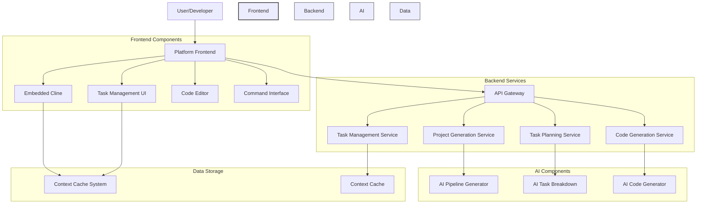
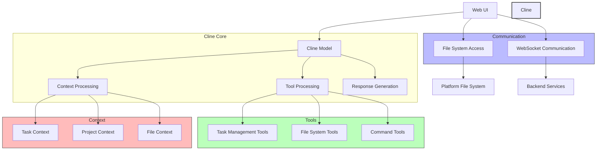
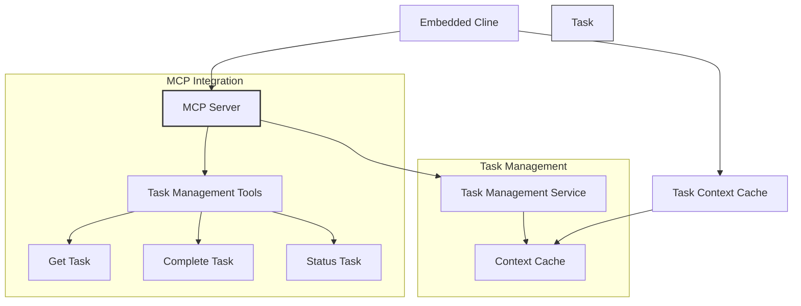
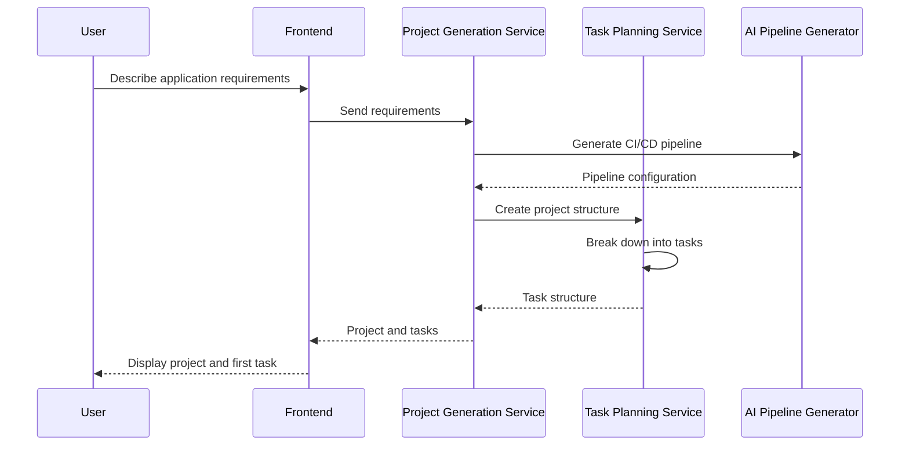
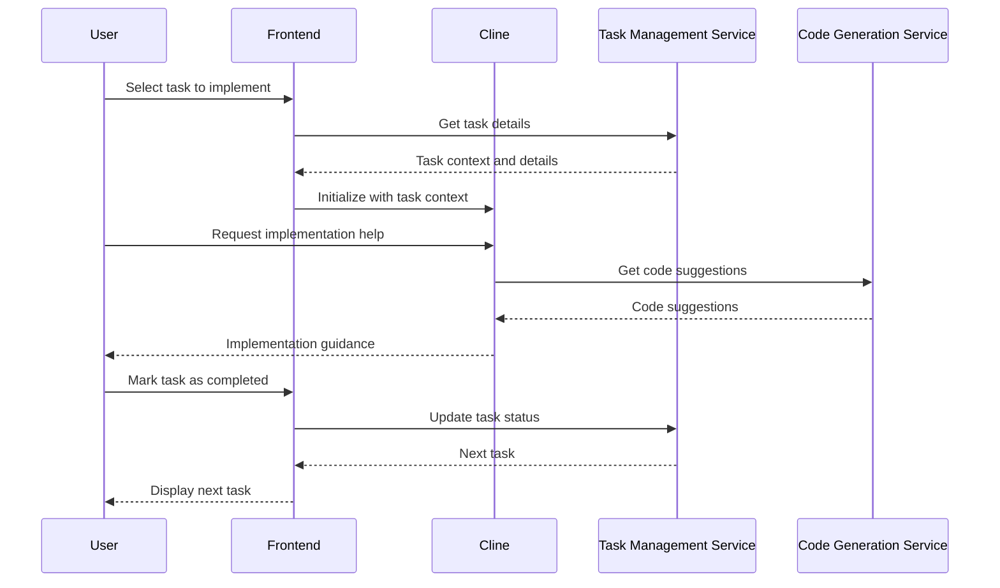

# Cline-Integrated AI CI/CD Platform Architecture

## Service Descriptions

- **Platform Frontend**: Web-based user interface for the integrated platform
- **Embedded Cline**: Web-compatible version of Cline integrated into the platform
- **Task Management UI**: Interface for managing tasks and tracking progress
- **Code Editor**: Web-based code editor for implementing tasks
- **Command Interface**: Terminal emulator for executing commands
- **API Gateway**: Central entry point for all backend services
- **Project Generation Service**: Creates new projects based on requirements
- **Task Planning Service**: Breaks down projects into tasks and sub-tasks
- **Code Generation Service**: Generates code based on requirements
- **Task Management Service**: Manages tasks and their lifecycle
- **Context Cache System**: Maintains and synchronizes context across components

## Communication Flow

1. Users interact with the Platform Frontend
2. Frontend components communicate with backend services through the API Gateway
3. Backend services use AI components for intelligent operations
4. Context is shared between components through the Context Cache System
5. Results are returned to the Frontend for display to the user

## Data Storage

- Context Cache stores project and task context
- File storage for project files
- Database for user data, projects, and tasks

## Embedded Cline Architecture

The Embedded Cline component is a web-compatible version of Cline that runs directly in the browser. Its internal architecture consists of:

### Component Descriptions

#### Cline Core
- **Cline Model**: The core AI model and processing logic
- **Tool Processing**: Handles tool execution and results
- **Context Processing**: Manages and processes context information
- **Response Generation**: Generates responses based on input and context

#### Communication
- **WebSocket Communication**: Real-time communication with backend services
- **File System Access**: Access to the platform's file system

#### Tools
- **Task Management Tools**: Tools for managing tasks
- **File System Tools**: Tools for working with files
- **Command Tools**: Tools for executing commands

#### Context
- **Task Context**: Context related to the current task
- **Project Context**: Context related to the overall project
- **File Context**: Context related to specific files

## Task Management System Integration

The Task Management System is integrated with Cline through:

### Integration Components

- **MCP Server**: Model Context Protocol server for extending Cline
- **Task Management Tools**: Tools exposed through the MCP server
- **Task Management Service**: Backend service for task management
- **Context Cache**: Shared cache for task and project context

## Project Generation Workflow

## Task Implementation Workflow

## Integration Points

The key integration points between components are:

1. **Cline ↔ Task Management System**: Through MCP server and context sharing
2. **Frontend ↔ Backend Services**: Through API Gateway
3. **Code Editor ↔ File System**: Through platform file system APIs
4. **Command Interface ↔ Execution Environment**: Through WebSocket communication
5. **AI Components ↔ Backend Services**: Through service-specific APIs

## Security Considerations

- Authentication and authorization for all API endpoints
- Secure WebSocket communication
- Sandboxed command execution
- Permission-based file system access
- Secure context sharing between components
